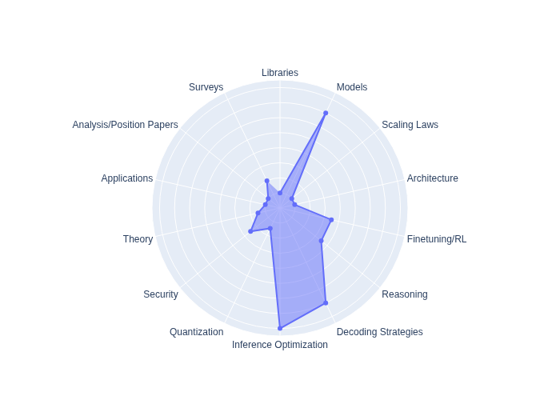

# awesome-dLLM-resources
Frequently updated list of dLLM (Diffusion Large Language Models) papers, models, and other resources. 

Maintained By Suhas Pai and Xiaojun Ren

Make a PR if you want to include your paper on this list or if you've found a cool paper that you think should be included in this list :)

## Libraries
- **DiRL: An Efficient Training Framework for Diffusion Language Models** - *November 18, 2025* <i><a href="https://github.com/OpenMOSS/DiRL" target="_blank">GitHub</a></i>
- **dLLM: Simple Diffusion Language Modeling** - *October 11, 2025* <i><a href="https://github.com/ZHZisZZ/dllm" target ="_blank">GitHub</a></i>

## Models
- **LLaDA2.0: Scaling Up Diffusion Language Models to 100B** — *December 10, 2025* <i><a href="https://www.arxiv.org/abs/2512.15745" target ="_blank">arXiv</a></i>
- **Causal Diffusion Language Models** - *December 4, 2025* <i><a href ="https://www.guidelabs.ai/post/block-causal-diffusion-language-model/" target ="_blank">Blog Post</a></i>
- **Soft-Masked Diffusion Language Models** — *October 20, 2025* <i><a href="https://arxiv.org/abs/2510.17206" target ="_blank">arXiv</a></i>
- **UltraLLaDA: Scaling the Context Length to 128K for Diffusion Large Language Models** — *October 12, 2025* <i><a href="https://arxiv.org/abs/2510.10481" target="_blank">arXiv</a></i>
- **RND1: Simple, Scalable AR-to-Diffusion Conversion** — *October 9, 2025* <i><a href="https://www.radicalnumerics.ai/blog/rnd1" target="_blank">Blog Post</a></i>
- **SDAR: A Synergistic Diffusion-AutoRegression Paradigm for Scalable Sequence Generation** - *October 7, 2025* <i><a href="https://arxiv.org/abs/2510.06303" target="_blank">arXiv</a></i>
- **Syntax-Guided Diffusion Language Models with User-Integrated Personalization** — *October 2, 2025* <i><a href="https://arxiv.org/abs/2510.01028" target="_blank">arXiv</a></i>
- **CoDA: Coding LM via Diffusion Adaptation** — *September 27, 2025* <i><a href="https://arxiv.org/abs/2510.03270" target="_blank">arXiv</a></i>
- **LLaDA-MoE: A Sparse MoE Diffusion Language Model** — *September 25, 2025* <i><a href="https://arxiv.org/abs/2509.24389" target="_blank">arXiv</a></i>
- **Dream 7B: Diffusion Large Language Models** - *August 21, 2025* <i><a href="https://arxiv.org/abs/2508.15487" target="_blank">arXiv</a></i>
- **DiffuCoder: Understanding and Improving Masked Diffusion Models for Code Generation** — *June 25, 2025* <i><a href="https://arxiv.org/abs/2506.20639" target ="_blank">arXiv</a></i>
- **Mercury: Ultra-Fast Language Models Based on Diffusion** — *June 17, 2025* <i><a href="https://arxiv.org/abs/2506.17298" target ="_blank">arXiv</a></i>
- **LLaDA 1.5: Variance-Reduced Preference Optimization for Large Language Diffusion Models** — *May 25, 2025* <i><a href="https://arxiv.org/abs/2505.19223" target="_blank">arXiv</a></i>
- **Large Language Diffusion Models** — *February 14, 2025* <i><a href="https://arxiv.org/abs/2502.09992" target="_blank">arXiv</a></i>

## Scaling Laws
- **Diffusion Language Models Are Super Data Learners** — *October 1, 2025* <i><a href="https://jinjieni.github.io/dlms-are-super-data-learners/resources/pdf/Diffusion_Language_Models_are_Super_Data_Learners.pdf" target="_blank">GitHub</a></i>
- **Diffusion Beats Autoregressive in Data-Constrained Settings** — *July 21, 2025* <i><a href="https://arxiv.org/abs/2507.15857" target="_blank">arXiv</a></i>

## Architecture
- **CANDI: Hybrid Discrete-Continuous Diffusion Models** - *October 26, 2025* <i><a href="https://arxiv.org/abs/2510.22510" target="_blank">arXiv</a></i>
- **Any-Order GPT as Masked Diffusion Model: Decoupling Formulation and Architecture** — *June 24, 2025* <i><a href="https://arxiv.org/abs/2506.19935" target="_blank">arXiv</a></i>

## Finetuning/RL
- **Diffusion LLM with Native Variable Generation Lengths: Let [EOS] Lead the Way** — *October 28, 2025* <i><a href="https://arxiv.org/abs/2510.24605" target="_blank">arXiv</a></i>
- **Principled and Tractable RL for Reasoning with Diffusion Language Models** — *October 5, 2025* <i><a href="https://arxiv.org/abs/2510.04019" target="_ blank">arXiv</a></i>
- **Fine-Tuning Masked Diffusion for Provable Self-Correction** — *October 1, 2025* <i><a href="https://arxiv.org/abs/2510.01384" target="_ blank">arXiv</a></i>
- **WeFT: Weighted Entropy-Driven Fine-Tuning for dLLMs** — *September 25, 2025* <i><a href="https://arxiv.org/abs/2509.20863" target="_ blank">arXiv</a></i>
- **Inpainting-Guided Policy Optimization for Diffusion Large Language Models** — *September 12, 2025* <i><a href="https://arxiv.org/abs/2509.10396" target="_ blank">arXiv</a></i>
- **Revolutionizing Reinforcement Learning Framework for Diffusion Large Language Models** — *September 8, 2025* <i><a href="https://arxiv.org/abs/2509.06949" target="_blank">arXiv</a></i>

## Reasoning
- **TiDAR: Think in Diffusion, Talk in Autoregression** — *November 12, 2025* <i><a href="https://arxiv.org/html/2511.08923v1" target="_blank">arXiv</a></i>
- **Enhancing Reasoning for Diffusion LLMs via Distribution Matching Policy Optimization** — *October 9, 2025* <i><a href="https://arxiv.org/abs/2510.08233" target="_blank">arXiv</a></i>
- **Improving Reasoning for Diffusion Language Models via Group Diffusion Policy Optimization** — *October 9, 2025* <i><a href="https://arxiv.org/abs/2510.08554" target="_blank">arXiv</a></i>
- **DiFFPO: Training Diffusion LLMs to Reason Fast and Furious via Reinforcement Learning** — *October 2, 2025* <i><a href="https://arxiv.org/abs/2510.02212" target="_blank">arXiv</a></i>
- **RFG: Test-Time Scaling for Diffusion Large Language Model Reasoning with Reward-Free Guidance** — *September 29, 2025* <i><a href="https://arxiv.org/abs/2509.25604" target="_blank">arXiv</a></i>
- **Thinking Inside the Mask: In-Place Prompting in Diffusion LLMs** — *August 14, 2025* <i><a href="https://arxiv.org/abs/2508.10736" target="_blank">arXiv</a></i>
- **d1: Scaling Reasoning in Diffusion Large Language Models via Reinforcement Learning** — *June 3, 2025* <i><a href="https://arxiv.org/abs/2504.12216" target="_blank">arXiv</a></i>

## Decoding Strategies
- **Beyond Static Cutoffs: One-Shot Dynamic Thresholding for Diffusion Language Models** — *November 3, 2025* <i><a href="https://arxiv.org/abs/2511.02077" target="_ blank">arXiv</a></i>
- **CreditDecoding: Accelerating Parallel Decoding in Diffusion Large Language Models with Trace Credits** — *October 7, 2025* <i><a href="https://arxiv.org/abs/2510.06133" target="_ blank">arXiv</a></i>
- **Self-Speculative Decoding for Diffusion Large Language Models** — *October 5, 2025* <i><a href="https://arxiv.org/abs/2510.04147" target="_ blank">arXiv</a></i>
- **AdaBlock-dLLM: Semantic-Aware Diffusion LLM Inference via Adaptive Block Size** — *September 30, 2025* <i><a href="https://arxiv.org/abs/2509.26432" target="_ blank">arXiv</a></i>
- **Don't Settle Too Early: Self-Reflective Remasking for Diffusion Language Models** — *September 28, 2025* <i><a href="https://arxiv.org/abs/2509.23653" target="_ blank">arXiv</a></i>
- **Time Is a Feature: Exploiting Temporal Dynamics in Diffusion Language Models** — *August 12, 2025* <i><a href="https://arxiv.org/abs/2508.09138" target="_ blank">arXiv</a></i>
- **Beyond Fixed: Training-Free Variable-Length Denoising for Diffusion Large Language Models** — *August 1, 2025* <i><a href="https://arxiv.org/abs/2508.00819" target="_ blank">arXiv</a></i>
- **Unveiling the Potential of Diffusion Large Language Model in Controllable Generation** — *July 6, 2025* <i><a href="https://arxiv.org/abs/2507.04504" target="_ blank">arXiv</a></i>
- **Remasking Discrete Diffusion Models with Inference-Time Scaling** — *March 1, 2025* <i><a href="https://arxiv.org/abs/2503.00307" target="_ blank">arXiv</a></i>

## Inference Optimization
- **Mask Tokens as Prophet: Fine-Grained Cache Eviction for Efficient dLLM Inference** — *October 10, 2025* <i><a href="https://arxiv.org/abs/2510.09309" target="_blank">arXiv</a></i>
- **dInfer: An Efficient Inference Framework for Diffusion Language Models** — *October 9, 2025* <i><a href="https://arxiv.org/abs/2510.08666" target="_blank">arXiv</a></i>
- **Accelerating Diffusion LLM Inference via Local Determinism Propagation** — *October 8, 2025* <i><a href="https://arxiv.org/abs/2510.07081" target="_blank">arXiv</a></i>
- **Free Draft-and-Verification: Toward Lossless Parallel Decoding for Diffusion Large Language Models** — *September 30, 2025* <i><a href="https://arxiv.org/abs/2510.00294" target="_blank">arXiv</a></i>
- **Fast-dLLM v2: Efficient Block-Diffusion LLM** — *September 30, 2025* <i><a href="https://arxiv.org/abs/2509.26328" target="_blank">arXiv</a></i>
- **Ultra-Fast Language Generation via Discrete Diffusion Divergence Instruct** — *September 29, 2025* <i><a href="https://arxiv.org/abs/2509.25035" target="_blank">arXiv</a></i>
- **d²Cache: Accelerating Diffusion-Based LLMs via Dual Adaptive Caching** — *September 27, 2025* <i><a href="https://arxiv.org/abs/2509.23094" target="_blank">arXiv</a></i>
- **Spiffy: Multiplying Diffusion LLM Acceleration via Lossless Speculative Decoding** — *September 22, 2025* <i><a href="https://arxiv.org/abs/2509.18085" target="_blank">arXiv</a></i>
- **Sparse-dLLM: Accelerating Diffusion LLMs with Dynamic Cache Eviction** — *August 4, 2025* <i><a href="https://arxiv.org/abs/2508.02558" target="_blank">arXiv</a></i>
- **Accelerating Diffusion Large Language Models with SlowFast Sampling: The Three Golden Principles** — *June 12, 2025* <i><a href="https://arxiv.org/abs/2506.10848" target="_blank">arXiv</a></i>
- **Fast-dLLM: Training-Free Acceleration of Diffusion LLM by Enabling KV Cache and Parallel Decoding** — *May 28, 2025* <i><a href="https://arxiv.org/abs/2505.22618" target="_blank">arXiv</a></i>
- **Accelerating Diffusion LLMs via Adaptive Parallel Decoding** — *May 31, 2025* <i><a href="https://arxiv.org/abs/2506.00413" target="_blank">arXiv</a></i>
- **dLLM-Cache: Accelerating Diffusion Large Language Models with Adaptive Caching** — *May 17, 2025* <i><a href="https://arxiv.org/abs/2506.06295" target="_blank">arXiv</a></i>

## Quantization
- **Quant-dLLM: Post-Training Extreme Low-Bit Quantization for Diffusion Large Language Models** — *September 27, 2025* <i><a href="https://arxiv.org/abs/2510.03274" target="_blank">arXiv</a></i>
- **Quantization Meets dLLMs: A Systematic Study of Post-Training Quantization for Diffusion LLMs** — *August 20, 2025* <i><a href="https://arxiv.org/abs/2508.14896" target="_blank">arXiv</a></i>
- **Dllmquant: Quantizing Diffusion-Based Large Language Models** — *August 14, 2025* <i><a href="https://arxiv.org/abs/2508.14090" target="_blank">arXiv</a></i>

## Security
- **DiffuGuard: How Intrinsic Safety Is Lost and Found in Diffusion Large Language Models** — *September 29, 2025* <i><a href="https://arxiv.org/abs/2509.24296" target="_blank">arXiv</a></i>
- **Where to Start Alignment? Diffusion Large Language Model May Demand a Distinct Position** — *August 17, 2025* <i><a href="https://arxiv.org/abs/2508.12398" target="_blank">arXiv</a></i>
- **Jailbreaking Large Language Diffusion Models: Revealing Hidden Safety Flaws in Diffusion-Based Text Generation** — *July 25, 2025* <i><a href="https://arxiv.org/abs/2507.19227" target="_blank">arXiv</a></i>
- **The Devil Behind the Mask: An Emergent Safety Vulnerability of Diffusion LLMs** — *July 15, 2025* <i><a href="https://arxiv.org/abs/2507.11097" target="_blank">arXiv</a></i>

## Theory
- **Optimal inference schedules for masked diffusion models** — *November 9, 2025* <i><a href="https://arxiv.org/pdf/2511.04647" target="_blank">arXiv</a></i>
- **Why mask diffusion does not work** — *September 25, 2025* <i><a href="https://arxiv.org/abs/2510.03289v1" target="_blank">arXiv</a></i>

## Applications
- **Harnessing LLM for Noise-Robust Cognitive Diagnosis in Web-Based Intelligent Education Systems** — *October 5, 2025* <i><a href="https://arxiv.org/abs/2510.04093" target="_blank">arXiv</a></i>
- **Discovering Mathematical Equations with Diffusion Language Model** — *September 16, 2025* <i><a href="https://arxiv.org/abs/2509.13136" target="_blank">arXiv</a></i>

## Position Papers
- **Understanding the Limitations of Diffusion LLMs through a Probabilistic Perspective** - *November 25, 2025* <i><a href="https://www.notion.so/Understanding-the-Limitations-of-Diffusion-LLMs-through-a-Probabilistic-Perspective-2ae0ba07baa88053b838d5bf0b0aad41#2af0ba07baa880c29fc4c8c198244cc8" target="_blank">Notion</a></i>

## Surveys
- **Beyond Autoregression: An Empirical Study of Diffusion Large Language Models for Code Generation** — *September 14, 2025* <i><a href="https://arxiv.org/abs/2509.11252" target="_blank">arXiv</a></i>
- **Diffusion-Based Large Language Models Survey** — *August 26, 2025* <i><a href="https://www.techrxiv.org/users/952417/articles/1321784-diffusion-based-large-language-models-survey" target="_blank">TechRxiv</a></i>
- **A Survey on Diffusion Language Models** — *August 14, 2025* <i><a href="https://arxiv.org/abs/2508.10875" target="_blank">arXiv</a></i>
- **Discrete Diffusion in Large Language and Multimodal Models: A Survey** — *June 16, 2025* <i><a href="https://arxiv.org/abs/2506.13759" target="_blank">arXiv</a></i>
